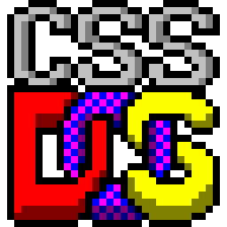

**CSS-DOS - an entire ’80s PC implemented in pure CSS, running Windows 1.01, MS-DOS, DOOM and more.**

An 8086 CPU, chipset, 640 KB RAM, floppy drive, keyboard, mouse and
screen - in one `.css` file. It’s a morbidly obese 300+ MB of
spec-compliant CSS, abused beyond recognition: some of the most
delightfully painful and wasteful code ever cursed to exist.

It boots **Microsoft Windows 1.01** and its namesake **MS-DOS**, and
runs real ’80s software. Yes, it runs **DOOM**.\*

<sub>\* barely.</sub>

### ▶ [Try it in your browser here](https://css-dos.ahmedamer.co.uk)


## How is that possible?
This question is tackled in depth [here]( https://css-dos.ahmedamer.co.uk/#about/how)


## How does it work? 
Here is a ✨🌟[full interactive walkthrough](https://css-dos.ahmedamer.co.uk/#about/file/map)✨

## Did you use AI?
<details>
  <summary>Expand to see (slightly long)</summary>
  
Yes, I did. A lot, actually. I haven't personally written much code by hand in the last year or so, but I would still say the code is _my code_. 

Claude churned out much of the mechanical work, helped me keep track, write good docs and organise commits, and write commit messages and comments. Prior to AI, these fell by the wayside due to my ADHD. It feels relevant to mention that I'm a published AI safety researcher and red-teamer, and am very aware that LLMs are not a tool one can just point at a problem and press 'Go'. I'd label this project 'LLM-assisted' but not 'vibe coded'.

I find AI writing to be cringe-inducing and bland. I'm typing this myself. All the copy on this website is edited by me personally with a real keyboard word-by-word, with only proofreading and mistake-fixing by Claude.

Claude could never have figured the project out on its own, but it was immensely helpful. Claude lacked the intuition to contribute reliably on a conceptual level, although it had its moments — the writable shadow-disk, and  tag hack in Calcite, among others were Claude’s idea. However, this project is an unusual one, taking Claude well out of distribution, and it often took a laughably inept path through implementations and needed constant shepherding. But what it lacked in smarts, it made up for in being able to spew out menial code at a rate that far surpasses mine, like a slightly dim intern with the speed of the Flash.

As a long-time tinkerer and coder, I do miss the romantic thrill of cobbling code together by hand, rolling the dice on it, and feeling that pay-off (or letdown). Perhaps this is the mindset of an old fogey, but there’s something about creating with your own two hands that’s lost when you order a minion to do it for you, no matter how beautiful the end product. The ideas are mostly mine, but I didn’t execute them.

But. This project wouldn’t exist without AI, full stop. I am 100% sure my patience would have run out before the machine booted. I don’t know Rust well, and couldn’t have coded Calcite myself. Claude made optimisations in it that I don’t fully understand. In fact, the day Fable 5 was released, it doubled or tripled Calcite’s performance in a single commit. There’s something lovely about that, although some part of me wishes I was the one who did it.

There’s a tension: accessibility / convenience / frictionlessness versus challenge / satisfaction / ownership. A game that offered you a button to immediately skip every level would be pointless. But what about skipping one level? What if the option only appeared after being stuck on it for a while first? What if it cost a bit of money, so you couldn’t do it willy nilly? When does that kind of option turn into a net positive?

Some part of me often wishes for less choice, to have challenge forced upon me. Dark Souls has no level-skipping. If it did I would have crumbled, sullying the achievement with an asterisk. But a lot of people have completed Dark Souls, and nobody has ever run a full OS in CSS. It would have been tempting to declare this project impossible and quit. Doing five out of six levels and seeing the end is arguably better than giving up.

Shunning LLMs feels like throwing the baby out with the bathwater. Maybe I’m spoiled, but considering brainlessly editing the CSS of this website myself has started to feel menial in an old-timey way, like washing clothes by hand or emptying the chamber pot. Maybe because I’ve had a taste of AI coding, or maybe I’ve had a taste of the depraved stuff and ordinary CSS doesn’t turn me on any more. Either way, I do want to automate centering divs and fiddling with line heights. That part is just an obstruction, a waste of time. Can someone make an AI model, that either teaches you new skills or automates things you can already do, rather than doing things entirely for you? I’d subscribe to that.

Until then, I hope for the restraint to use tools to reach higher places, not to avoid getting off my arse at all.
</details>


## How is performance?

A browser evaluates all of this at roughly **two instructions per
second** — three weeks to boot DOS, if it didn’t freeze first. So the
sibling project [**Calcite**](https://github.com/stop-amertime/calcite),
a JIT compiler for computational CSS (Rust → WebAssembly), runs the
same file **200,000× faster** — without adding, changing, or removing
a single byte of it, and bound by the project’s cardinal rule: it must
produce exactly what a spec-compliant browser would, byte for byte.
[Why that isn’t cheating →](https://css-dos.ahmedamer.co.uk/#about/calcite)


### How / how much was AI used in this project? 

See [here](https://css-dos.ahmedamer.co.uk/#about/faqs/ai) for more info on how much I used AI in the project. 


## The 30-second version (for developers)

A **cart** (folder or zip) contains a DOS program. The **builder** takes
a cart, picks a **BIOS**, assembles a **floppy**, feeds it to **Kiln**
(the transpiler), and produces a **cabinet** — a self-contained `.css`
file. You play a cabinet in Chrome via the **player**, or fast via
Calcite.

```
$ node builder/build.mjs carts/rogue -o rogue.css
$ npm run dev                              # Vite dev server on :5173
$ open http://localhost:5173/build.html    # build/load the cabinet, then play
```

Or run it fast through Calcite:

```
$ ../calcite/target/release/calcite-cli -i rogue.css
```

## Vocabulary

| Word | Meaning |
|---|---|
| **cart** | Input folder or zip: a program, any data files, optional `program.json`. |
| **floppy** | FAT12 disk image the builder assembles from a cart. Internal. |
| **cabinet** | The built artifact - a single `.css` file, runnable. |
| **Kiln** | The transpiler. Turns an 8086 memory image into CSS. |
| **builder** | Orchestrator. Wires up BIOS → floppy → Kiln. |
| **BIOSes** | Three flavors: **Gossamer** (hack-path shim), **Muslin** (assembly DOS BIOS), **Corduroy** (structured C DOS BIOS, default). |
| **player** | Static HTML at `web/player/calcite.html`; loads `/cabinet.css` (served from the SW cache via `build.html`). |
| **Calcite** | Sibling repo: the JIT that runs cabinets fast. |

## Start here

- New to the project? → [`docs/architecture.md`](docs/architecture.md)
- Making a cart? → [`docs/cart-format.md`](docs/cart-format.md) + [`docs/building.md`](docs/building.md)
- Hacking on the codebase? → [`CLAUDE.md`](CLAUDE.md) + [`docs/INDEX.md`](docs/INDEX.md)

## Repo layout

```
builder/         Orchestrator CLI and stages
kiln/            The transpiler (née transpiler/src)
bios/
  gossamer/      Hack BIOS
  muslin/        Assembly DOS BIOS
  corduroy/      Structured C DOS BIOS (default)
web/             Front-end: player (calcite.html, raw.html, bench.html), shim, dev server, prebake bins
                 Build/load page: web/site/build.html. Service worker: web/site/sw.js
conformance/     Reference emulators for diff testing
carts/           Example carts
dos/             DOS kernel + COMMAND.COM
tools/           Build utilities (mkfat12, image converters, js8086)
tests/           Conformance test programs
docs/            Full documentation
legacy/          Archived earlier approaches
```

## Status

See [`docs/logbook/STATUS.md`](docs/logbook/STATUS.md) for the live
project status. Current default cabinet path boots DOS + the cart's
program end-to-end. Rom-disk mechanism exposes disks outside 8086
memory, so cabinet size is no longer bounded by a floppy size.

## Credits

- Lyra Rebane ([rebane2001](https://github.com/rebane2001)) - the
  original [x86css](https://github.com/rebane2001/x86css), a 16-bit
  x86 CPU in pure CSS. CSS-DOS grew out of it.
- Jane Ori - the [CPU Hack](https://dev.to/janeori/expert-css-the-cpu-hack-4ddj).
- [emu8](https://github.com/nicknisi/emu8) - the reference 8086 emulator.
- [Doom8088](https://github.com/FrenkelS/Doom8088) by Frenkel Smeijers -
  id Software’s DOOM, ported to the 16-bit 8088/8086.
- EDR-DOS via [SvarDOS](https://svardos.org/), and Microsoft’s
  [MS-DOS 4.00](https://github.com/microsoft/MS-DOS) (MIT, 2024).

Full credits on [the site](https://css-dos.ahmedamer.co.uk/#about/credits).

## License

GNU GPLv3.
