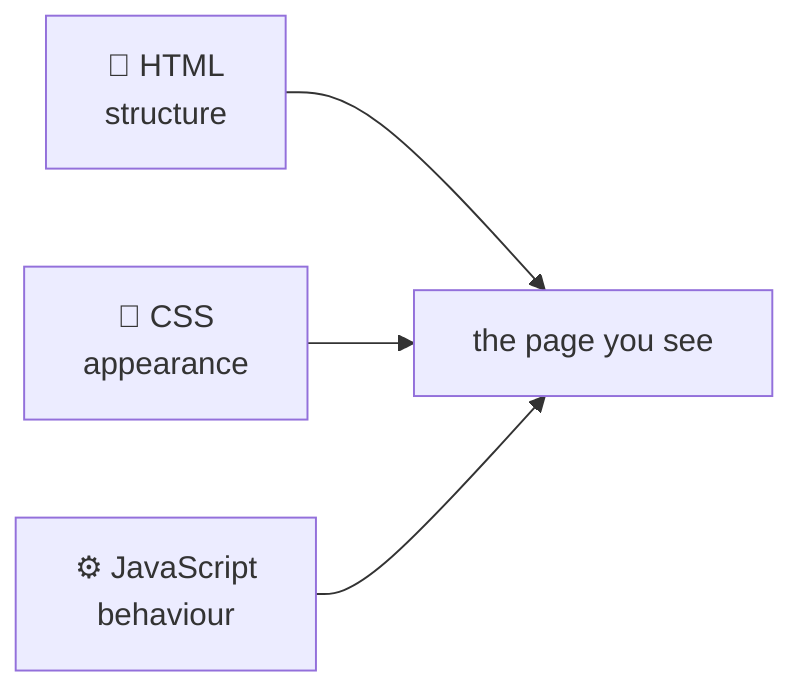
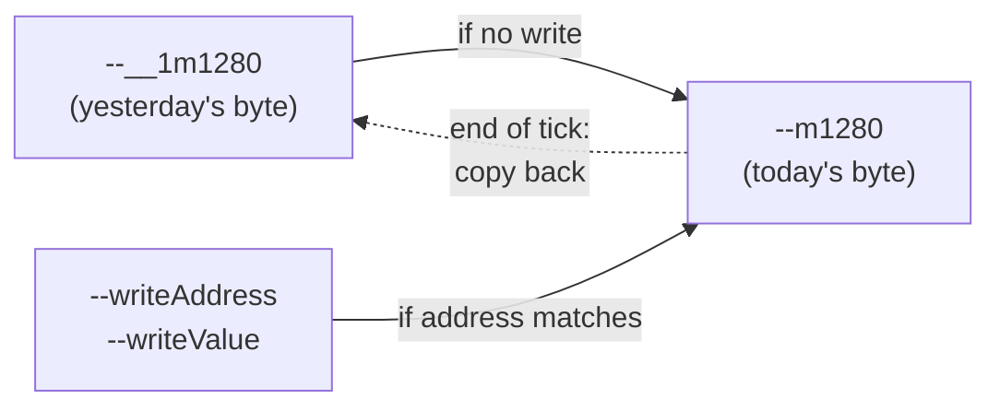
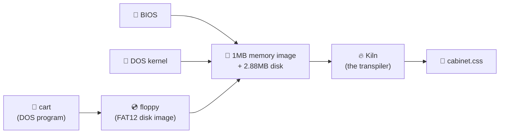

# How CSS-DOS works

## A guide, from the ground up

---

## Section 1 — A quick orientation: what is this thing?

Most websites use three languages working together:

- **HTML** is the structure — the boxes, the headings, the buttons.
- **CSS** is the paint — what colour the buttons are, where they sit, how big the text is.
- **JavaScript** is the behaviour — what happens when you click, type, scroll.

It looks roughly like this:



CSS is, traditionally, the most boring of the three. It's a styling language. You tell the browser "this paragraph is red, that heading is 24 pixels tall," and the browser obeys. It is not, on the face of it, a *programming* language. It can't add two numbers and remember the answer. It can't ask the user a question. It can't open a file.

**This project runs the original 1981 IBM PC inside CSS.**

Not "uses CSS for the look." Not "JavaScript that styles things with CSS." We mean: a `.css` file — the same kind that normally just decides what colour your headings are — boots an Intel 8086 processor, runs DOS, loads the original *Doom*, and (eventually) shows you the marine.

There is no JavaScript doing the work. There is no WebAssembly, no clever runtime, no hidden engine. There is one stylesheet. It is *executing machine code*.

> 💡 **The shape of the trick**
>
> CSS is famously *not* a programming language.
> So we made one out of it anyway.
> Then we used that to emulate a 40-year-old computer.
> Then we ran *Doom* on it.

### How preposterous is this, exactly?

Some numbers, to set the tone for everything that follows:

| Thing | Size |
|---|---|
| The complete works of Shakespeare | ~5 MB of text |
| A typical website's CSS | ~50 KB |
| `hello-text.css` — a CSS-DOS cabinet that just prints "hello" | **3 MB** |
| `zork1.css` — the text adventure *Zork* as a single stylesheet | **300 MB** |
| `doom8088.css` — *Doom*, as a single stylesheet | **352 MB** |

That's right: the stylesheet for *Doom* is **roughly 70× the entire works of Shakespeare**. One file. About 1.8 million lines of CSS. If you printed it out single-spaced, you'd get a stack of paper around 60 metres tall — taller than the Statue of Liberty without her pedestal.

It is also, by the project's own admission, too much CSS for any web browser to actually open.

> *"A complete Intel 8086 PC implemented in pure CSS. The CSS runs in Chrome (in theory — in practice it crashes it)."*
> — the project's own README

So we wrote a second program, **Calcite**, whose only job is to read the CSS and pretend to be Chrome, but faster, without crashing. Calcite is allowed to be quick. Calcite is **not** allowed to know anything about computers, processors, DOS, or *Doom*. Calcite only knows CSS. The fact that this CSS happens to be a working PC is, formally, none of Calcite's business.

### What you'll learn in the rest of this guide

We'll build the whole stack from the bottom up:

1. **What CSS can and can't do** — the cliff at the edge of the styling language.
2. **The trick that turns CSS into a programmable machine** — counters, custom properties, and a 400-millisecond heartbeat.
3. **How to store memory in a stylesheet** — one CSS variable per byte, half a million of them.
4. **How to execute an instruction** — reading an opcode, decoding it, writing the result back, all in style rules.
5. **The floppy disk that doesn't fit in memory** — a separate trick for storing data outside the 8086's tiny address space.
6. **How we cheat with Calcite** — what counts as "the same CSS, just faster" and what would be cheating.
7. **Why everything is so absurdly large** — and why we like it that way.

Each layer is, on its own, a fairly small idea. Stacked together, they let a stylesheet play *Doom*.

Let's start with the cliff.

---

## Section 2 — Walking to the Moon

Let's go back to basics. Here's a CSS rule:

```css
.circle {
  background: red;
  width: 100px;
  height: 100px;
  border-radius: 50%;
}
```

You read this as a sentence: *"any element with the class `circle` should be a red square with rounded corners, big enough to look like a circle."* The browser reads it the same way. It's a description.

Crucially, it is a description that **does not run**. Nothing happens "in order." Nothing decides what to do next. The browser looks at every box on the page, asks the stylesheet *"what should this look like?"*, and paints accordingly. CSS is, in the technical jargon, **declarative**: you declare what you want, you don't write steps to get there.

This is, you would think, the end of the story.

It is not the end of the story.

---

### CSS has more than you'd think

If you peer past the surface, CSS quietly contains four things that no styling language really has any business having:

**It does maths.** Anywhere you'd write a number, you can write a calculation:
```css
.circle { width: calc(50px / 2); }   /* 25 pixels */
```
Real arithmetic. Plus, minus, times, divide, sine, square root, the lot.

**It has variables.** You can name a value and use it in lots of places:
```css
:root { --brand-red: #c0392b; }
.button { background: var(--brand-red); }
```
Those `--double-dashed` names are called **custom properties**. Read them back with `var()`. Do maths on them. Change them later.

**It can choose.** Since 2025, CSS has a real if-statement:
```css
.button {
  background: if(
    style(--enabled: 1): green;
    else: grey
  );
}
```
*"If this variable is 1, use green; otherwise grey."*

**It has a clock.** Animations make values change over time, automatically, sixty times a second:
```css
@keyframes pulse {
  0%   { --beat: 0; }
  50%  { --beat: 1; }
  100% { --beat: 0; }
}
```

Maths. Memory. Choice. A clock. Stack those four things together and a strange thing happens: you've crossed a quiet line called **Turing-completeness**. There's a theorem in computer science that says any system with those ingredients can, in principle, compute *anything any computer can compute.* CSS qualifies. CSS is, technically, a programming language.

In principle.

---

### The walk

Here's the catch.

**Saying something is Turing-complete is like saying any distance is walkable.** It's true. Given enough time, your legs will get you anywhere on Earth. They'll get you to the next town. They'll get you to the next country. They'll get you, eventually, *off the planet* — there's no rule that says walking has to stop at the atmosphere. Anywhere is walking distance, if you've got the time.

But the time, as it turns out, is the whole story.

**CSS-DOS runs *Doom* in CSS in exactly the same way a person walks to the Moon.** Technically, sure. In practice, the practice is the funny part.

Here's the file:

```
doom8088.css         368,552,116 bytes
```

That's the entire stylesheet for *Doom*. One file. About 1.8 million lines.

> 🌕 **If every character in this file were one step**
>
> A normal walking pace covers about 0.75 metres per step. So:
>
> 368,552,116 characters × 0.75 m = **276,414 kilometres**
>
> The Moon is **384,400 kilometres** away.
>
> Reading the *Doom* stylesheet, character by character, gets you **72% of the way to the Moon.**
>
> If you walked eight hours a day at a normal pace, it would take you **about nineteen years.**

For perspective, a typical website's CSS is around 50 kilobytes. That's 50,000 characters — about **37 kilometres on foot.** A long day's hike. Done by sunset, home for tea.

The *Doom* stylesheet is a hike to the Moon.

And it isn't even the only one. *Zork* — a text adventure from 1980, no graphics, just words on a screen — is **300 megabytes of CSS.** Roughly 225,000 km of walking. *Halfway to the Moon, for a text adventure.* The whole genre is moonshot-scale.

> 💡 **The shape of the trick**
>
> CSS is, in theory, a programming language.
>
> Like walking is, in theory, a way to get to the Moon.
>
> We did it anyway.

---

### Why is it so far?

Because CSS, brilliant as it is, is missing some things you'd usually take for granted:

| What CSS *can* do | What CSS *cannot* do |
|---|---|
| ✅ Do arithmetic | ❌ Read a file |
| ✅ Store named values | ❌ Take keyboard input on its own |
| ✅ Choose between options | ❌ Talk to the network |
| ✅ Tick on a clock | ❌ Print anything anywhere |
| ✅ React to the page around it | ❌ Call other programs |

Every red cross on the right is a thing a normal computer does without thinking. CSS has the *brain* of a computer but none of the *hands.*

Which means: if we want a computer, we have to build the entire thing — every register, every flag, every byte of memory, every instruction the CPU knows, the keyboard, the screen, the disk, the BIOS, DOS, and the program running on top — **out of nothing but the four things CSS has.** Maths, memory, choice, and a clock.

We're not allowed to ask the browser to do anything. We can only ask the browser, *very politely,* what colour something should be. And if our answer happens to involve simulating an entire 1981 IBM PC for one tick of its clock, well — that's between us and the stylesheet.

That's the walk. The rest of this guide is how we actually take the steps.

---

### One small confession before we set off

The project's own README puts it like this:

> *"A complete Intel 8086 PC implemented in pure CSS. The CSS runs in Chrome — in theory. In practice, it crashes it."*

Chrome is built to handle stylesheets that describe *websites.* It is not built to handle stylesheets that describe *CPUs.* Doom-as-CSS is around 1.8 million lines of conditional arithmetic, and Chrome's style engine, asked to evaluate that for every animation frame, falls over from sheer weight.

So we wrote a second program called **Calcite** that reads the same CSS file — *the exact same one Chrome would, byte for byte* — and evaluates it the way Chrome would, but quickly, without dying. Calcite is the subject of a much later section. For now, hold this thought:

**The CSS is real.** It is a complete, working description of an 8086 PC. Calcite doesn't add cleverness on top — it just walks the same 276,000 kilometres faster than Chrome can. If Chrome could keep up, we wouldn't need Calcite at all.

Now. Let's start taking steps.

---

## Section 3 — How to remember a number

We've talked a lot about what CSS *can* do. Now let's actually do something with it. Let's build the smallest, most fundamental piece of a computer: **a single byte of memory.**

A byte holds a number from 0 to 255. That's it. Eight little bits, capable of remembering whether a key was pressed, or how red a pixel is, or what the next instruction should be. A 1981 IBM PC has a million of them.

We're going to build one.

---

### Step 1: a name and a value

Recall from the last section that CSS has variables, called **custom properties:**

```css
:root {
  --byte-at-address-1280: 0;
}
```

We've just declared a name (`--byte-at-address-1280`) and given it a value (`0`). Anywhere else in the stylesheet, we can read this back:

```css
.something {
  width: calc(var(--byte-at-address-1280) * 1px);
}
```

So far, so normal. This is what custom properties are *for.*

But here's the first wrinkle: a custom property, by default, is just a piece of text. CSS doesn't know that `0` is a number. As far as the browser is concerned, it could be `0`, or `"hello"`, or `unicorn`. It only becomes a number at the moment we use it inside `calc()`.

For a CPU, that's not good enough. We need the browser to know, *firmly and at all times,* that this thing is a number — specifically, an integer between 0 and 255. We need it to **type-check** our byte.

For that, CSS gives us this:

```css
@property --m1280 {
  syntax: '<integer>';
  inherits: true;
  initial-value: 0;
}
```

Read it as a little contract with the browser:
- *"Hereby register a property called `--m1280`."*
- *"Its value will always be an integer."*
- *"It starts at zero."*
- *"Pass it down to child elements."*

That's a real byte. It has a name (`m1280` — short for "memory at address 1280"). It has a type (integer). It has a starting value (zero). It can be read with `var(--m1280)`. It can be written by changing it. The browser will refuse to put non-numbers into it.

**Congratulations. We've stored one byte.**

---

### Step 2: a million of them

A 1981 IBM PC has 1,048,576 bytes of memory — one megabyte. So now we just write that `@property` block… a million times.

```css
@property --m0       { syntax: '<integer>'; inherits: true; initial-value: 0; }
@property --m1       { syntax: '<integer>'; inherits: true; initial-value: 0; }
@property --m2       { syntax: '<integer>'; inherits: true; initial-value: 0; }
@property --m3       { syntax: '<integer>'; inherits: true; initial-value: 0; }
...
@property --m1048574 { syntax: '<integer>'; inherits: true; initial-value: 0; }
@property --m1048575 { syntax: '<integer>'; inherits: true; initial-value: 0; }
```

Each block is about 80 characters. A million of them is 80 megabytes of stylesheet, *for the RAM alone, doing nothing.* Just sitting there. Empty boxes, waiting for numbers.

> 🚶 **The walk so far**
> 80 megabytes of CSS = ~80 million characters = **about 60,000 km of walking.** One and a half laps around the Earth, just for the empty memory.
>
> And we haven't put a CPU in yet. Or a screen. Or a program.

This is the first place the project's absurd file sizes start to make sense. There's no clever compression trick available — *each byte needs its own variable*, because each byte has to be readable and writable independently. A million bytes means a million names.

(In practice CSS-DOS only declares the bytes it actually needs — empty regions of memory aren't worth the disk space. The full sprawl is closer to a few hundred thousand bytes, packed cleverly into half as many properties, which we'll get to. But the principle stands: one variable per byte, give or take.)

---

### Step 3: writing to a byte

Now the trickier half. *Reading* a byte is easy — `var(--m1280)`. But how do you *write* to it?

This is where CSS-as-a-computer starts to get genuinely strange, because CSS is **declarative**. You can't say *"set --m1280 to 42."* That's an instruction, and CSS doesn't do instructions. CSS only does descriptions.

What you *can* do is **describe what the new value should be, given the old one.** Like this:

```css
@property --m1280 {
  syntax: '<integer>';
  inherits: true;
  initial-value: 0;
}

.cpu {
  --m1280: if(
    style(--writeAddress: 1280): var(--writeValue);
    else: var(--__1m1280)
  );
}
```

Read this slowly. It says:

> *"The new value of `--m1280` is: if some other variable called `--writeAddress` is currently 1280, it becomes whatever `--writeValue` is. Otherwise, it stays the same — keep the old value (`--__1m1280` is the previous tick's value, which we'll explain shortly)."*

This is a description, not an instruction. It's saying *what `--m1280` is,* in terms of other things. The browser, evaluating the stylesheet, looks at `--writeAddress`, looks at `--writeValue`, and computes the new `--m1280` from them. Every time anything changes, this rule re-evaluates, and the byte either updates or stays put.

That's how you write to memory in CSS. **Every byte is permanently, eternally watching a single global "are you being written to right now?" channel,** ready to either grab the new value or keep the old one. A million bytes, a million little watchers, all checking simultaneously, every tick.

---

### Step 4: the past tense problem

There's one detail I glossed over. Did you spot it?

Look at the rule again:

```css
.cpu {
  --m1280: if(
    style(--writeAddress: 1280): var(--writeValue);
    else: var(--__1m1280)
  );
}
```

The "else" branch reads `--__1m1280`, not `--m1280`. Why?

Because we're *defining* `--m1280` right here, in this rule. We can't use its own current value to define its new value — that's a circular reference, and CSS, like every other reasonable language, refuses.

So CSS-DOS keeps **two copies of every byte**: the current one (`--m1280`) and the previous tick's value (`--__1m1280`, with a "1" in the name standing for "one tick ago"). At the end of every tick, the current values get copied into the previous-tick variables, and the next tick begins. *"Today's value is yesterday's value, unless something wrote to me, in which case it's the new value."*



This means **every byte exists twice in the stylesheet.** Two `@property` blocks, two assignment rules. We just doubled our character count. The Moon is getting closer.

---

### Step 5: where does the writing actually come from?

We've been talking about `--writeAddress` and `--writeValue` as if they were just sitting around. They're not. They're set by the *CPU* — by whatever instruction is running on this tick.

If the program does the 8086 equivalent of *"store the number 42 at address 1280,"* then on that tick:

- `--writeAddress` becomes `1280`
- `--writeValue` becomes `42`

Every byte in memory wakes up, looks at `--writeAddress`, and asks: *"is that me?"*

- Byte 1279 looks: nope, not me. Stays the same.
- Byte 1280 looks: that's me! Grabs `--writeValue`. Becomes 42.
- Byte 1281 looks: nope. Stays the same.
- ... and so on, for every byte in the machine.

A million bytes, every single tick, all asking *"is it my turn?"* and all but one of them shrugging and going back to sleep. This is the heartbeat of CSS-DOS. It's why the file is so big. It's why it's so slow in Chrome. It's why we needed to build Calcite.

It's also, secretly, kind of beautiful. There's no "memory controller" in this design — no central thing routing writes to the right byte. Every byte routes *itself,* by asking the same question at the same time. The CPU shouts an address into the void; one byte answers.

---

### Step 6: but wait — we cheat a little

If you do the maths on a million bytes, each watching a single write address per tick, you only ever get to write *one byte per tick.* That would make our pretend computer impossibly slow. Real 8086 instructions sometimes write **two bytes at once** (a 16-bit value), and some BIOS routines want to push a whole stack frame.

So CSS-DOS doesn't have one write channel — it has **six.** Six pairs of `--writeAddress` and `--writeValue`, numbered 0 through 5. Every byte checks all six every tick:

```css
.cpu {
  --m1280: if(
    style(--writeAddress0: 1280): var(--writeValue0);
    style(--writeAddress1: 1280): var(--writeValue1);
    style(--writeAddress2: 1280): var(--writeValue2);
    style(--writeAddress3: 1280): var(--writeValue3);
    style(--writeAddress4: 1280): var(--writeValue4);
    style(--writeAddress5: 1280): var(--writeValue5);
    else: var(--__1m1280)
  );
}
```

Six `if`-checks, every byte, every tick. That's six million questions per tick, asked by the bytes themselves, the answer to almost all of which is *"no."*

The Moon is now considerably further away.

---

### What we have so far

A box that holds a number. A million of them. A way to write to one (or up to six) of them, by having every box ask itself the same question at once. A way to remember yesterday's value so today's value can be defined in terms of it.

This is **just the memory.** No CPU. No program. No screen. Just a million tiny variables, all paying very close attention to a small set of broadcast write channels, every fraction of a second.

In the next section, we'll build the thing doing the broadcasting: the **CPU.** It will turn out to be, in some ways, even sillier than the memory.

---

## Section 4 — The CPU, which is also some CSS

So we have a million little boxes, each waiting to be told it's their turn. The thing that does the telling is the CPU.

In a real 1981 IBM PC, the CPU is a fingernail-sized rectangle of silicon containing about 29,000 transistors, made by Intel and called the 8086. Its job, simplified to within an inch of its life, is this:

1. Look at memory to find out what to do next.
2. Do it.
3. Repeat, four million seven hundred thousand times a second.

That's a processor. Everything else is detail.

In CSS-DOS, the CPU is a stylesheet. It has the same job, performs it considerably more slowly, and is made not of transistors but of `if()` statements. Let's see how that works.

---

### What "an instruction" actually is

When you compile a program for the 8086, what comes out the other end is a long string of numbers. Each number — or, more often, each small group of numbers — is an **instruction**. The CPU reads them one at a time and does what they say.

For instance, the byte `0x40` means *"add one to the AX register."* The byte `0x90` means *"do nothing for one tick."* The bytes `0xB8 0x05 0x00` together mean *"put the number 5 into the AX register."* There are about two hundred such instructions, each a number or a short sequence of them, each meaning something specific. The CPU's entire life is spent reading these numbers and performing the matching action.

The bit of CPU state that remembers *which byte to look at next* is called the **instruction pointer**, written `IP`. It's just a number — an address into memory. Each tick, the CPU:

- reads the byte at `IP`,
- works out what instruction that is,
- does it,
- moves `IP` forward by however many bytes the instruction was.

In CSS-DOS, all of this happens in style rules. Let's build it.

---

### Reading the next instruction

The instruction pointer is, naturally, a custom property:

```css
@property --IP {
  syntax: '<integer>';
  inherits: true;
  initial-value: 0;
}
```

To find out what instruction we're meant to run this tick, we read whichever memory byte `--IP` points at. And here, immediately, we hit a small problem. We can't write `var(--m{var(--IP)})` — CSS doesn't let you build variable names out of other variables. There's no such thing as a dynamic lookup.

So we do the only thing we can do, which is ask every possibility at once:

```css
.cpu {
  --opcode: if(
    style(--IP: 0):    var(--m0);
    style(--IP: 1):    var(--m1);
    style(--IP: 2):    var(--m2);
    /* ... */
    style(--IP: 1048574): var(--m1048574);
    style(--IP: 1048575): var(--m1048575);
    else: 0
  );
}
```

That's a million-line `if`-statement whose only purpose is to look up *one number.* It says *"if IP is 0, the opcode is the byte at address 0; if IP is 1, the opcode is the byte at address 1;"* and so on, exhaustively, for the entire address space. The browser, every tick, evaluates this and produces the right byte.

The Moon is, you'll be unsurprised to hear, somewhat further away.

(In practice CSS-DOS only emits these for addresses that could plausibly contain code, which trims things considerably. But the shape of the trick is the same.)

---

### Doing what the instruction says

Now we have `--opcode`. It's a number from 0 to 255. We need to act on it.

The 8086 has eight main registers — small numbered pigeonholes the CPU keeps near at hand for things it's currently working on. They're called `AX`, `BX`, `CX`, `DX`, `SI`, `DI`, `BP`, and `SP`, and like everything else, they're custom properties. The job of the CPU each tick is to update each register according to whatever the current opcode says to do.

So, for the AX register, we write a rule that defines its new value as a giant choice over every opcode that might affect it:

```css
.cpu {
  --AX: if(
    style(--opcode: 0x40):  calc(var(--__1AX) + 1);     /* INC AX */
    style(--opcode: 0x48):  calc(var(--__1AX) - 1);     /* DEC AX */
    style(--opcode: 0xB8):  var(--immediate-word);      /* MOV AX, imm */
    style(--opcode: 0x05):  calc(var(--__1AX) + var(--immediate-word)); /* ADD AX, imm */
    /* ... about a hundred more entries ... */
    else: var(--__1AX)
  );
}
```

You can read this as a description of what AX is at the end of this tick: *"if the current opcode is 0x40 it's yesterday's AX plus one; if it's 0x48 it's yesterday's AX minus one; if it's 0xB8 it's the immediate value the program supplied;"* and so on for every instruction that touches AX. Anything else, AX stays as it was. The same shape of rule exists for each of the other seven registers, plus the flags, plus the instruction pointer, plus the segment registers, plus the stack pointer — every piece of CPU state, defined as a giant `if`-chain over the current opcode.

Memory writes work the same way. From the previous section, you'll remember that every byte is watching six broadcast write channels. Those channels (`--writeAddress0`, `--writeValue0`, and so on) are themselves defined the same way:

```css
.cpu {
  --writeAddress0: if(
    style(--opcode: 0x88):  var(--effective-address); /* MOV r/m8, r8 */
    style(--opcode: 0x89):  var(--effective-address); /* MOV r/m16, r16 */
    /* ... */
    else: -1
  );
  --writeValue0: if(
    style(--opcode: 0x88):  var(--__1AL);
    style(--opcode: 0x89):  var(--__1AX);
    /* ... */
    else: 0
  );
}
```

If the current opcode is one that writes to memory, those channels carry the address and value. If not, the address is set to a sentinel (-1, which no real byte will match) and the bytes all keep their old values. The effect is that the CPU broadcasts *"here's what I'm writing this tick"* into the void, the bytes in memory all listen, and at most six of them respond.

That's the entire architecture. A handful of large `if`-chains, one per piece of CPU state, each defining *what that piece becomes* in terms of *what it was* and *what the current opcode is*. There's no central dispatcher, no switch statement, no event loop. The browser just resolves the stylesheet and the CPU advances by one instruction.

---

### A quick aside: the problem of "what is yesterday's AX, exactly?"

You may have noticed that all the rules above read `var(--__1AX)` rather than `var(--AX)`. This is the same trick from the memory section: we can't define `--AX` in terms of itself, so we keep yesterday's value in `--__1AX` and read from that.

But that raises a question. *When* does today's `--AX` become tomorrow's `--__1AX`? Something has to do that copying, and it has to happen at the right moment, after the current tick's computation is done but before the next tick starts.

The answer is a CSS animation. We have one running constantly in the background that toggles a property called `--clock` between four values — 0, 1, 2, 3, 0, 1, 2, 3 — and the work of one tick is split across these four phases. Two of them compute new values, two of them copy the new values into the "yesterday" slots. The browser, evaluating the stylesheet, does the right thing in each phase because the rules say *"only do this if the clock is 1"* or similar. The clock advances itself, the phases follow, and an instruction completes every four ticks of the animation.

We'll come back to the clock — it's the thing that turns this whole apparatus from a static description into a running machine — but for now, the relevant fact is that there *is* a heartbeat, and the bytes and registers know which beat they're on.

---

### How long is the dispatcher?

Each of the eight registers gets its own giant `if`-chain. The flags register gets one. Each of the six memory write channels gets two (address and value). The instruction pointer gets one. The segment registers each get one.

By the time you've covered every instruction the 8086 supports, multiplied by every register or memory slot that instruction might touch, you're looking at something on the order of **a hundred and fifty thousand lines of dispatcher CSS**, before you've added a single byte of program memory. That's roughly Antarctica-to-the-tip-of-South-America's worth of walking, in stylesheet form, just to convince the browser to act like a CPU.

The processor is, in this sense, the smallest part of the file. Most of `doom8088.css` is the program itself — *Doom*'s code and data, every byte of it pinned to its own custom property, watching the broadcast channels.

---

### One small ungainly truth

The CPU we've described has roughly the architecture of a real 8086, but built backwards. A real CPU is a network of physical components — adders, multiplexers, decoders — each doing one specific small thing, all wired together so that an instruction propagates through them like water through plumbing. The CSS version has none of this. It has a giant lookup table, expressed as a giant conditional, which the browser evaluates afresh every tick.

This makes it, in a sense, more honest than a real CPU. There's no pipelining, no speculative execution, no branch prediction, no cache. There is one rule per piece of state, and the rules say what the state is. If you wanted to formally prove the CPU correct, you could read the stylesheet top to bottom and check each rule against the 8086 manual. (You would be there for some time.)

It also makes it absurdly inefficient, which is what the next section is about: how on earth do we get this thing to run faster than once-per-glacier, and what does that have to do with a compiler called Calcite.

---

## Section 5 — A heartbeat made of animation

We've now got memory and a CPU, and they're both rather good at sitting there doing absolutely nothing.

This is the awkward truth about everything we've built so far. The CPU's giant `if`-statement says *"the new value of AX is this, given the current opcode."* But the browser only re-evaluates that rule when *something changes,* and in our stylesheet, nothing has any reason to. The CPU is a perfectly correct description of an 8086 frozen mid-thought. To bring it to life, something has to keep nudging it.

For real computers this is solved with a quartz crystal. You pass electricity through a small lump of quartz and it wobbles, very precisely, several million times a second. You count the wobbles, and each wobble is one tick. The whole CPU keeps in step with this wobble — registers update, instructions advance, the world moves on.

We don't have a quartz crystal. We have CSS animations. They will, it turns out, do nicely.

---

### A wobble, in CSS

Recall from a few sections ago that CSS animations let a value change over time. The simplest possible heartbeat looks like this:

```css
@keyframes anim-play {
  0%   { --clock: 0; }
  25%  { --clock: 1; }
  50%  { --clock: 2; }
  75%  { --clock: 3; }
}

.clock {
  animation: anim-play 400ms steps(4, jump-end) infinite;
}
```

This says: *over 400 milliseconds, change `--clock` from 0 to 1 to 2 to 3, in discrete steps, and then loop forever.* The `steps(4, jump-end)` part is what stops the browser from gradually interpolating between values — we don't want `--clock: 1.7`, we want it to jump cleanly from 1 to 2 to 3.

So now we have a variable that changes value, by itself, four times every 400 milliseconds. That's our wobble. One tick of the 8086 happens every full cycle of `--clock`, which means our pretend computer runs at the dizzying rate of **two and a half instructions per second.**

You may recall that a real 8086 manages around four million seven hundred thousand instructions per second. We are, currently, off by a factor of roughly two million. We'll come back to that.

---

### Why four phases and not one

A quick puzzle: if a tick is just *"work out the new register values from the old ones,"* why do we need *four* phases? Why not one?

The answer is the trouble with self-reference we kept hitting in the memory and CPU sections. We can't define `--AX` in terms of `--AX`, so we keep yesterday's value in `--__1AX` and read from that. But "yesterday" needs a moment in which to *become* yesterday. Specifically, today's `--AX` has to get copied into tomorrow's `--__1AX`, and that copy can't happen at the same instant as the rule that uses `--__1AX` to compute the new `--AX`, or we'd be back to the circular definition we were trying to avoid.

So a tick is split into phases:

| Phase | `--clock` | What happens |
|---|---|---|
| Compute | 1 | The big `if`-statements re-evaluate. New register values appear in `--AX`, `--BX`, etc. |
| Settle | 2 | (Spacer.) |
| Store | 3 | Each new register value gets copied into a "previous tick" slot. |
| Settle | 0 | (Spacer.) |

The two compute-and-store phases are real work. The two between them are pauses, in which the browser catches up with itself. In the real codebase the phases are wired up as two separate CSS animations, *store* and *execute*, both paused by default and selectively un-paused depending on which value `--clock` currently holds. It's the kind of arrangement that, if you described it to anyone unfamiliar with the constraints, would make them slowly back out of the room.

But it works. Every 400 milliseconds the browser walks the four phases, the CPU advances by one instruction, and the bytes in memory do or don't update according to what the instruction said.

---

### Two and a half instructions per second

This is where the bill arrives.

Two and a half instructions per second is, to put it gently, not a usable rate. The first thing a real DOS computer does on startup is load the operating system from disk, which involves something like a hundred million instructions before the prompt appears. At our heartbeat, that takes about a year and a half.

There are two ways out of this, and CSS-DOS uses both.

The first is to point out that 400 milliseconds is a polite default, not a law. You can ask the browser to run animations faster, or you can sneak in a tiny piece of JavaScript that ignores the animation entirely and bumps `--clock` manually as fast as the browser can keep up. The pure-CSS player does the former; an alternative player called *turbo* does the latter, and the entire piece of JavaScript responsible looks like this:

```js
function step() {
  for (let i = 0; i < 4; i++) {
    clock.style.setProperty('--clock', t, 'important');
    t = (t + 1) % 4;
    getComputedStyle(cpu).getPropertyValue('--__1IP');
  }
  if (parseInt(getComputedStyle(cpu).getPropertyValue('--__1halt') || '0', 10)) return;
  requestAnimationFrame(step);
}
```

That is the entire engine. It walks the clock 0→1→2→3 by hand, asks the browser to recompute the stylesheet after each change (which is what the `getComputedStyle` line does), and then waits for the next animation frame to do it all again. The CSS doesn't know any of this is happening — it just notices that `--clock` keeps changing and dutifully re-evaluates every rule that depends on it. Twenty-four lines of JavaScript and we're suddenly running at sixty ticks a second, or about fifteen instructions per second.

This is, you may have noticed, still terrible. Fifteen instructions per second gets us to the DOS prompt sometime in 2099.

The second way out is Calcite, which is the next section.

---

### A note on what counts

Before we move on, it's worth being clear about what the JavaScript shim is and isn't doing. It is *not* helping the stylesheet do its work. It is not running any of the 8086 logic. It is not deciding what the next opcode means or computing the new value of AX. All of that still happens in CSS, in exactly the same `if`-statements we've been looking at. The shim's only job is to keep nudging `--clock` so the browser bothers to re-evaluate.

This matters because the project's central conceit — *"the CSS is a complete, working description of an 8086 PC"* — would be a lie if we were quietly doing the real work in JavaScript. We're not. The pure-CSS player runs the same cabinet using nothing but the animation, just glacially. The turbo shim and Calcite (next section) are both, in this sense, *speed-readers* for the same stylesheet. They argue about how fast to walk to the Moon. They don't change the route.

---

## Section 6 — Calcite, or: how to walk to the Moon faster

Here is the situation we're in. We have a stylesheet that fully and faithfully describes a 1981 IBM PC. We have a clock that keeps it ticking. We have, in principle, a working computer made entirely of style rules.

We also have Chrome — the browser the whole thing was theoretically designed for — refusing point-blank to open the file. *Doom* as CSS is around 1.8 million lines, and Chrome's style engine, asked to re-evaluate all of them every animation frame, runs out of patience long before it runs out of memory. The project's README is unusually honest about this:

> *"The CSS runs in Chrome. In theory — in practice, it crashes it."*

So we wrote Calcite. Calcite is a separate program, written in Rust, and its single solitary job is to do exactly what Chrome would do — read the stylesheet, evaluate its rules, work out what each variable becomes after each tick — but quickly, and without falling over.

---

### The thing Calcite is *not* allowed to do

If you've been paying attention you'll have spotted the trap waiting here. The whole point of CSS-DOS is that the stylesheet is the computer. If Calcite is allowed to look at the stylesheet, notice it describes an 8086, and quietly switch to running an 8086 emulator instead, then we don't have a CSS computer any more. We have a fairly ordinary emulator with a stylesheet glued to its side as a kind of decoration.

The project has a name for the rule that prevents this: the *cardinal rule*. Stated baldly:

> **Calcite must produce the same results Chrome would, just faster.**

Not *similar* results. The same results. Calcite is not allowed to know that the file is a CPU. It is not allowed to know what an opcode is, or that there are registers, or that 0x40 means "increment AX." It reads the file as CSS — `@property` blocks, `if()`-statements, `var()` references, `calc()` expressions — and evaluates them honestly, the way a browser would. If the CSS is wrong, the fix goes in the CSS. Calcite does not get to patch around it.

This sounds like a self-imposed handicap, and it is, but it's the *whole point*. A CSS-shaped computer that runs fast because we secretly cheated isn't a CSS-shaped computer. It's just an emulator.

---

### So how *does* it go faster, then?

Calcite's trick is that it notices **shapes** in the CSS, not meanings.

Consider the giant register-dispatch `if`-statement from a couple of sections ago — the one with about a hundred branches, each saying *"if `--opcode` is some specific number, then AX becomes this expression."* Chrome, being a general-purpose browser, evaluates this by walking the branches in order: *is the opcode 0x40? no. is it 0x48? no. is it 0xB8? no.* It does this every tick, for every register, for every channel.

Calcite reads the same `if`-statement and recognises a *shape* it has seen before: a long chain of equality tests against a single variable, with each branch returning a different expression. That's a lookup table. Calcite compiles it into one — a hash map from opcode to expression — and the next time the rule fires, it does one lookup instead of a hundred comparisons.

That's the entire idea, repeated about thirty different ways. A long `if`-chain comparing against a single variable becomes a hash map. Six parallel "is this address mine?" checks across a million bytes become a single sparse index. A four-way clock state machine becomes a counter. None of these transformations require any knowledge of the 8086 or DOS or *Doom*. They're patterns in the CSS itself, the kind a sufficiently determined optimising compiler will spot in any program.

The result is that Calcite runs a CSS-DOS cabinet at somewhere around four hundred thousand ticks per second, against Chrome's three or four. That's enough to boot DOS in a few seconds, load *Doom* in about half a minute, and get the marine on screen at — admittedly — about a fifth of a frame per second. The performance work is ongoing. *Doom* on a stylesheet was always going to be a long walk.

---

### What you actually run

This means there are, in practice, two ways to run a CSS-DOS cabinet.

The **pure-CSS player** is a static HTML page, about a hundred lines, that loads the stylesheet, attaches it to a `<div>`, and lets Chrome get on with it. This is the version that works in theory and fails in practice. Tiny cabinets — a few kilobytes of code printing "hello" to the screen — run fine. Cabinets that contain an entire DOS install do not. The pure-CSS player is the *demonstration* that the whole thing is real CSS. It is not how you actually play *Doom*.

The **Calcite-backed player** is the same HTML page, but with a small WebAssembly module embedded that contains Calcite's CSS evaluator. The cabinet still loads as a stylesheet. The evaluator runs Calcite's compiled version of it, ticks the clock as fast as it can, and writes the resulting framebuffer to a `<canvas>`. From the outside, you cannot tell which engine is running. They produce the same pixels.

You can also, if you like, run cabinets entirely outside the browser via a command-line tool. Calcite doesn't really care where it runs, only that it gets a CSS file to chew on.

---

### The cardinal rule, in one sentence

The project's CLAUDE file phrases the rule like this:

> *"You may restructure CSS to be easier to JIT-optimise, as long as Chrome still evaluates it the same way and produces the same results. Expressing the same computation in a different, more pattern-recognisable shape is fine. What is NOT fine: dummy code, metadata properties, or side-channels whose only purpose is to 'signal' to Calcite or sneak information to Calcite. The CSS must pay for itself in Chrome."*

This is the bit that makes the project tick (so to speak). The CSS isn't allowed to wink at Calcite. It isn't allowed to leave a little note saying *"this bit's the CPU dispatcher, by the way."* If a piece of CSS exists, it has to do real work in Chrome — even if Chrome will only ever evaluate it once before falling over. Calcite is then allowed to be clever about how it speeds things up, but only by being clever *about CSS*, not by being clever *about computers*.

If you find that distinction precious or pedantic, well — yes. That's the whole project, really. The fun is in the constraint.

---

## Section 7 — Drawing pixels with a stylesheet

We've spent five sections building a CPU that nobody can see. It's time to fix that.

Here's the situation. *Doom* runs in what's called **mode 13h**, which is a graphics mode the original IBM PC supported in the late 1980s. In mode 13h the screen is 320 pixels wide by 200 pixels tall, and each pixel is a single byte — a number from 0 to 255 — that picks one of 256 possible colours from a separate table called the **palette**.

The screen lives at a specific spot in memory: 64,000 bytes starting at address `0xA0000`. The first byte is the top-left pixel, the next byte is the pixel to its right, and so on, row by row, until you reach the bottom-right corner 64,000 bytes later. To draw something, the program writes bytes into that region. To change a pixel, you change a byte. There is no API, no graphics library, no draw call. The screen is just *memory you can see.*

This turns out to be enormously convenient for us, because we already have memory.

---

### The trick

Every byte from `--m655360` to `--m719359` is, secretly, a pixel. They're already there. They're already updating every tick. The CPU writes to them through the same six broadcast channels it uses for everything else. From the stylesheet's point of view, these bytes are not special.

All we need is a way to *show* them.

The pure-CSS player does this by drawing a 320×200 grid of `<div>` elements onto the page, one per pixel, and writing a CSS rule that says: *each div's background colour is determined by the value of its corresponding memory byte, looked up in the palette.* When the program writes to address `0xA0001`, the byte changes; the rule re-evaluates; the second pixel changes colour. The screen is, quite literally, a live view of part of memory.

This works. It is also, predictably, ruinous. Sixty-four thousand `<div>` elements, each with a re-evaluating background rule, asked to redraw themselves several times a second, is the sort of thing browsers were not built to enjoy.

The Calcite-backed player skips the divs entirely. Once per frame, it reads the 64,000 video-memory bytes out of Calcite, looks each one up in the palette, and writes the resulting pixels straight into a `<canvas>`. The CSS still describes the screen the same way; Calcite just notices that nobody's making it draw 64,000 individual divs and quietly produces the framebuffer in one go.

Either way, the principle holds: **the screen is memory, the memory is custom properties, and the custom properties are CSS.** A pixel changing colour is, in the strictest sense, a stylesheet re-evaluating.

---

### The palette, as a small sub-puzzle

There's one subtlety worth a moment. Each pixel byte is an index into a palette of 256 colours, and the palette itself lives in memory too — 768 more bytes (one red, one green, one blue per colour) at a different address. Programs change the palette constantly. *Doom* uses this to do the "screen flashes red when you take damage" effect: it doesn't redraw any pixels, it just shifts every entry in the palette towards red for a few frames.

So the rule that decides a pixel's colour is, properly speaking, a two-step lookup: *take the memory byte at this pixel's address, treat it as a number, and use that number to index the palette table elsewhere in memory.* Two giant `if`-chains, nested. One for the pixel value, one for the palette entry. Both made of style rules, both re-evaluating every tick, both contributing handsomely to the file size.

When *Doom* flashes red on damage, what's actually happening is: 768 bytes get written, 256 palette colours change, and 64,000 `<div>` background rules silently re-evaluate to point at the new colours. The pixels themselves don't move. The stylesheet just changes its mind about what they look like.

---

### Text mode, briefly

Before *Doom* boots, you spend a few seconds looking at text — DOS messages, the kernel's startup banner, the program's own loading screen. This is a different graphics mode, called **text mode**, in which each "pixel" is actually a *character*: an 80-column, 25-row grid where each cell holds a letter and a colour code.

The mechanism is exactly the same. Text-mode video memory lives at `0xB8000`. Each cell is two bytes — one for the character (an ASCII code), one for the foreground and background colour. The CSS-DOS player draws an 80×25 grid of `<span>` elements, each with a rule that reads its two memory bytes, looks the character up in a font table, and styles the cell accordingly. When DOS prints `A:\>`, what actually happens is that four memory bytes get written, four spans re-evaluate their content, and four characters appear.

There are no `console.log`s. There is no terminal. There is a stylesheet, looking at memory.

---

## Section 8 — The disk that won't fit

A small but important fact about the 1981 IBM PC: it could only ever address one megabyte of memory. Not because the hardware designers were cheap, but because the CPU's address bus was 20 bits wide, and twenty bits gives you exactly 1,048,576 distinct addresses, no more and no fewer. This was, at the time, an *enormous* amount of room. Bill Gates is famously supposed to have said something to the effect of *"640 kilobytes ought to be enough for anyone,"* though he denies ever having said it; in any case nobody really expected the limit to bite.

The limit, of course, bit. Almost immediately. By the late 1980s, programs routinely came on floppy disks holding 1.44 megabytes — *more than the entire address space of the computer they were meant to run on.* By the time *Doom* arrived in 1993, the data files were tens of megabytes. The PC industry spent two decades inventing increasingly elaborate workarounds (extended memory, expanded memory, protected mode, the A20 line, the high memory area — each with its own story, none of them happy) to get around the fact that a 16-bit CPU can only see a megabyte at once.

We are emulating the 16-bit CPU. We have inherited all of its problems.

Specifically: *Doom*'s data file, called `DOOM1.WAD`, is **2.88 megabytes.** Almost three times the entire RAM of the machine it's running on. We need this file to be available to *Doom* at runtime, on demand, and we are storing the whole machine in a file format whose only job, traditionally, is to colour in headings.

This is fine. We have a plan.

---

### The plan

A real PC, asked to deal with a file bigger than its memory, would store the file on a *disk* and ask the disk for one chunk at a time. Disks are slow but enormous. Memory is fast but small. The whole architecture of computing for the first thirty years was built around this trade-off.

The disk in a real PC isn't sitting inside the megabyte of RAM — it's a separate device, off to the side, that the CPU talks to through the BIOS. When *Doom* wants a chunk of `DOOM1.WAD`, it asks the BIOS *"please load 512 bytes starting at sector 4,712 into this spot in memory,"* the BIOS twiddles some hardware ports, the disk wakes up, the sector arrives, and *Doom* reads it from RAM as if it had always been there.

We're going to do exactly this, except the disk is going to be made of CSS, and it's going to live just outside the megabyte of RAM, in a place the CPU can sort of see if it squints.

---

### The window

Here is the trick, and it is genuinely lovely.

Inside the 8086's one megabyte of address space, there's a small region — 512 bytes, the size of a single disk sector — that we set aside as a *window*. Its address is `0xD0000` to `0xD01FF`. As far as the CPU is concerned, this is normal memory. You can read it. You can copy from it. Nothing about it looks unusual.

But the bytes you read from it aren't stored anywhere in the megabyte of RAM. They're stored *outside it*, in a much larger array — the 2.88-megabyte disk image. When the CPU reads byte `0xD0042`, the stylesheet doesn't look up `--m851010`. It does something else entirely.

Specifically: there's a separate variable, called `--lba`, that holds a sector number. (LBA stands for *Logical Block Address* — sector 0 is the first 512 bytes of the disk, sector 1 is the next 512 bytes, and so on.) When the CPU reads any byte in the window, the rule looks up *"byte 0x42 of sector `--lba` of the disk."* Change `--lba`, and the entire window's contents change. It's not a region of memory; it's a *view onto whichever sector you've currently asked to see*.

Reading from the disk, then, looks like this from inside the program:

1. *"I'd like sector 4,712 please."* — the CPU writes 4712 into the variable `--lba`.
2. *"Now copy 512 bytes from address `0xD0000` to my buffer."* — a normal memory-to-memory copy, the kind the 8086 does in its sleep.

The window, transparently, returns the bytes of sector 4,712. Nobody had to know it wasn't ordinary RAM.

---

### Where the actual disk bytes live

So far so good. But where, in CSS, *is* the disk?

It's a giant `if`-chain, naturally. The stylesheet contains a function called `--readDiskByte`, with one branch per non-zero byte of the disk image. It looks roughly like this, except imagine it goes on for considerably longer:

```css
@function --readDiskByte(--idx) {
  result: if(
    style(--idx: 0):     0xEB;
    style(--idx: 1):     0x3C;
    style(--idx: 2):     0x90;
    style(--idx: 3):     0x4D;
    /* ...about three million more lines... */
    style(--idx: 3014655): 0x00;
    else: 0
  );
}
```

Three million entries. Every byte of the disk image, encoded as a CSS `if`-branch. When the CPU reads byte `0xD0042` and the current `--lba` is 4712, the rule evaluates `--readDiskByte(4712 * 512 + 0x42)`, which is index 2,412,610, which sends the browser hunting through three million `if`-branches looking for the right one.

This is, you'll be unsurprised to hear, the single biggest section of the *Doom* stylesheet. The disk dispatch alone is around 200 megabytes of CSS. About **150,000 kilometres of walking,** entirely for the disk lookup. *Roughly one-way to the Moon, just for the file format.*

In the *Doom* cabinet, Calcite recognises this dispatch as a particularly long lookup table and compiles it down to a flat byte array — the disk image, reconstituted in memory, indexed in O(1). For Chrome, of course, no such mercy: it walks the chain.

---

### The pleasing thing about the trick

What makes this lovely, rather than just gross, is that **nothing in the 8086 knows the disk is special.** The CPU's instruction set has no concept of "disks." The BIOS just does memory copies through a region that happens to behave a bit oddly. The program (in *Doom*'s case, a perfectly ordinary DOS executable that has no idea it's running inside a stylesheet) issues normal `INT 13h` BIOS calls to read sectors, exactly as it would on real hardware, and bytes appear in its buffer.

The "disk" is a fiction. It's a 512-byte region of CSS-DOS's pretend memory whose values are computed on demand from a much larger array stored elsewhere. From outside this is a profound architectural lie. From inside, it's so banal that *Doom* doesn't even blink.

This is the same shape as the trick we played with the screen, by the way. The screen "is" memory. The disk "is" memory. Almost everything in CSS-DOS, when you look closely, turns out to be memory wearing different hats. The CPU's job, in the end, is just to push numbers around between hats.

---

## Section 9 — How a cabinet gets built

Time to talk about how this thing is actually made. We've been treating `doom8088.css` as if it appeared from nowhere. It didn't. It was *built*, by a small pile of programs that turn an ordinary DOS executable into a 350-megabyte stylesheet.

The pipeline has a vocabulary worth learning, because the project uses these words constantly:

| Word | What it is |
|---|---|
| **cart** | A folder containing a DOS program. Like a cartridge for an old games console — drop one in, it boots. |
| **floppy** | A simulated 1980s floppy disk, in standard FAT12 format. Built from the cart. |
| **BIOS** | The little firmware program that boots the machine and provides basic services. The project has three of them, with names like fabric (Gossamer, Muslin, Corduroy). |
| **Kiln** | The transpiler. Turns a pile of bytes (BIOS + DOS + program + disk) into one enormous stylesheet. |
| **cabinet** | The output `.css` file. Like a cabinet in an arcade — self-contained, plug it in, play it. |

Putting these together, the build pipeline looks like this:



Let's walk through each step.

---

### Step 1: assemble a floppy

The cart is just a folder. To make it look like a disk a 1980s computer can boot from, the builder creates a **FAT12 filesystem image** — the same disk format that floppies actually used in 1981, byte-for-byte, with the original directory structure, allocation tables, and boot sector. This is a real, period-accurate disk image; if you wrote it to an actual floppy with a real disk drive (good luck finding one), it would boot a real PC.

The floppy contains `COMMAND.COM` (the DOS shell), the program from the cart, any data files it needs (like *Doom*'s 2.88 MB WAD), and a small autoexec script that runs the program on startup. It's a complete, bootable DOS environment in about three megabytes.

### Step 2: lay out memory

Now the builder builds the **memory image** — what the 8086's RAM should look like at the moment the machine turns on. This involves:

- Dropping the BIOS at the top of memory, where the CPU expects to find it on boot.
- Setting up the **interrupt vector table** at the bottom of memory (the small list of addresses the CPU jumps to when various events happen — keypresses, timer ticks, BIOS calls).
- Loading the DOS kernel into low memory.
- Reserving regions for the screen, the disk window, and various BIOS scratch areas.
- Filling in some standard PC bookkeeping (the BIOS Data Area, the keyboard buffer, all the small but important things real PCs come with).

What comes out is a 1-megabyte byte array that, if you loaded it into an actual 8086, would do something useful. We don't load it into an actual 8086. We hand it to Kiln.

### Step 3: Kiln does its thing

Kiln is the transpiler. Its job is to take the memory image and the disk and produce a stylesheet that *behaves the same way the original PC would,* using all the tricks we've been describing.

It walks through the memory image and emits, for each byte, the two custom-property declarations and the corresponding write-rule entries. For ranges of memory that are read-only (like the BIOS), it bakes the values into the rules as constants and skips the write rules entirely. For RAM, it emits the full apparatus.

It then emits the **CPU dispatch table** — the giant `if`-chains that turn opcodes into register and memory updates. These are actually the same for every cabinet: `MOV` always means `MOV`, regardless of which DOS program you're running. The CPU dispatch is roughly 150,000 lines of CSS that gets stamped out fresh every build.

It emits the **disk dispatch** — the three-million-line `--readDiskByte` function from the previous section.

It emits the **clock and the animation keyframes** — the small heartbeat we built in Section 5.

And it staples on a tiny snippet of HTML — the **player** — that loads the resulting stylesheet, attaches it to a div, and lets the browser get on with it.

The whole pipeline takes a few seconds. The output is a `.css` file weighing somewhere between three megabytes (for "hello, world") and 350 megabytes (for *Doom*). You can open it in a text editor if you have a brave one. It will scroll for a long time.

---

### A note on the BIOSes

A small detail worth mentioning. The project has *three* different BIOSes, and which one a cabinet uses changes its character. They are, in order of complexity:

- **Gossamer** is for raw `.COM` programs that don't need DOS at all. Tiny. Used mostly for tests and demos.
- **Muslin** is a hand-written assembly DOS BIOS — fast, terse, accurate enough to boot most things.
- **Corduroy** is a proper structured C BIOS. Slower than Muslin but easier to maintain and extend, and it's what most cabinets use today, including *Doom*.

Each one is a complete piece of firmware that handles keyboard input, screen output, disk reads, timer interrupts, and the half-dozen other services that DOS programs expect to find. They're written in real assembly and C, compiled with real compilers, and end up as bytes in the memory image that Kiln then turns into CSS. The BIOS is no different, from the stylesheet's point of view, than the program it's booting. It's just bytes in particular places.

The fabric names — Gossamer, Muslin, Corduroy — are an aesthetic choice. They go from sheer to sturdy in roughly the order the BIOSes themselves do.

---

### What the player actually is

We've mentioned it a few times. The player is a static HTML file. It looks, in essence, like this (simplified):

```html
<link rel="stylesheet" href="doom8088.css">
<div class="clock"></div>
<div class="cpu"></div>
<div class="screen">
  <!-- 64,000 pixel divs go here, generated on load -->
</div>
```

That's the whole thing. A `<link>` to the stylesheet, a div for the clock to attach its animation to, a div for the CPU's dispatch rules to attach to, and a screen made of small empty divs whose backgrounds are determined by the current contents of video memory. The Calcite-backed player is the same skeleton plus a small WebAssembly module and a `<canvas>`.

There is no engine. There is no runtime. There is one stylesheet, one clock, and a wall of pixels watching it.

---

## Section 10 — A small museum of clever tricks

If you've made it this far, you've earned a reward. This is the bit where I show you some of the genuinely lovely sleight-of-hand the project does inside the stylesheet. None of these are essential to understanding the whole — they're showpieces, the kind of thing the people working on CSS-DOS have probably stared at for an hour each before solving.

I'll try to keep the maths gentle.

---

### Trick 1: how to do a left-shift when you've never heard of bits

Computers spend a lot of time *shifting* numbers — moving all their bits a few positions to the left or right. A real CPU has a dedicated piece of circuitry for this, called a barrel shifter, that can move every bit of a number sideways in a single tick. If you ask the 8086 to shift the number `0b00010110` left by two, you get `0b01011000`, instantly.

CSS, of course, doesn't have bits. CSS has *numbers*, and four arithmetic operations, and not even quite all of those. Asking it to "shift left" is like asking a calculator to play chess.

But here's the thing. *Shifting left by N is the same as multiplying by 2^N.* `0b00010110` shifted left by 2 is `0b01011000`, which in decimal is 22 → 88, which is 22 × 4, which is 22 × 2². The bits moving sideways and the value getting bigger are the same operation seen from two different angles.

So the project's "left shift" function is, in its entirety, this:

```css
@function --leftShift(--a, --b) {
  result: calc(var(--a) * pow(2, var(--b)));
}
```

*"To shift `a` left by `b`, multiply it by 2 to the power of `b`."* That's the whole shifter. The corresponding right shift uses integer division:

```css
@function --rightShift(--a, --b) {
  result: round(down, var(--a) / pow(2, var(--b)));
}
```

It is, in a sense, an embarrassingly simple observation. But it means that *every shift instruction in the 8086* — and there are quite a few of them — comes down to multiplication or division. The CPU's barrel shifter, replaced by a high-school identity.

---

### Trick 2: making numbers wrap around like a real CPU

Real CPUs don't have unlimited numbers. The 8086's registers hold values from 0 to 65,535, and if you add 1 to 65,535 you don't get 65,536 — you get 0, and the CPU sets a little flag to remember that you overflowed. This is called **wraparound**, and almost every program relies on it working correctly.

CSS has unlimited numbers. Add 1 to 65,535 in CSS and you get 65,536, like any sensible mathematician. This is, for our purposes, a problem.

The fix is another small algebraic identity. *Wrapping a number to N bits is the same as taking it modulo 2^N.* Or, in CSS:

```css
@function --lowerBytes(--a, --b) {
  result: mod(var(--a), pow(2, var(--b)));
}
```

That's the whole wraparound function. Pass it a value and the number of bits to keep, and it returns the value with everything above those bits chopped off. The 16-bit world of the 8086 is, in CSS terms, *the regular world of arithmetic, viewed through `mod(x, 65536)`.*

This function gets called *constantly.* Every time the CPU computes a new value for a register, the result is fed through `--lowerBytes(..., 16)` to keep it inside the legal range. Every time it computes a new instruction pointer, every time it pushes onto the stack, every time it does arithmetic and updates the flags. In a loose sense, half of CSS-DOS's job is computing arbitrary mathematical results and then immediately throwing the high bits away.

---

### Trick 3: comparing numbers, when CSS won't tell you which is bigger

Here is one of the genuinely strange constraints of doing computation in CSS. **CSS has no comparison operator.** You can't write `if(a > b)`. The `if()` function tests for *equality*, and that's all. There's no greater-than, no less-than, no test for "is this number positive."

This is fine for matching opcodes — every opcode is a specific number, and equality tests work. But the moment you need to ask *"did this counter just go negative?"* or *"which of these two values is bigger?"*, you're stuck.

Until you remember that CSS does have one function with an opinion about positive versus negative: `sign()`. It returns -1 for negative numbers, 0 for zero, and +1 for positive numbers. Combined with `max(0, ...)`, you can extract a clean 0-or-1 answer to *"is this number greater than that one?"* without ever using a comparison:

```
max(0, sign(a - b))
```

If `a > b`, the difference is positive, `sign` returns 1, `max` keeps it at 1.
If `a ≤ b`, the difference is zero or negative, `sign` returns 0 or -1, and `max(0, ...)` clamps it to 0.

The result is a number that's exactly 1 when `a > b` and exactly 0 otherwise — which you can multiply other expressions by, to gate them on the comparison being true. You've just built an `if`-statement out of `sign` and `max`.

This is how the project's PIT timer (the chip that fires periodic interrupts on a real PC) decides whether it's time to wrap. The relevant line, lifted directly from the codebase, looks like this:

```css
var(--__1pitCounter) - var(--_pitDecrement)
  + max(0, sign(calc(var(--_pitDecrement) - var(--__1pitCounter) + 1))) * var(--__1pitReload)
```

Read it carefully: *"the new counter is the old counter minus the decrement, plus — IF the decrement is bigger than the counter — the reload value."* The `max(0, sign(...))` term is a fully-functional "if" that produces 1 when the timer should wrap and 0 when it shouldn't, expressed entirely with arithmetic. No branches. Pure algebra.

The project does dozens of variations on this. If you ever need to ask CSS *"is X bigger than Y?",* you subtract, take the sign, clamp with max, and multiply.

---

### Trick 4: the four-phase clock, redux

We talked about the clock in section 5. Here's the part I held back.

We said the CPU has two animations attached to it — one called *store*, one called *execute* — both paused by default, and that the two get selectively un-paused depending on the current value of `--clock`. The actual code that does this is one of my favourite small things in the project:

```css
.cpu {
  animation: store 1ms infinite, execute 1ms infinite;
  animation-play-state: paused, paused;
  @container style(--clock: 1) { animation-play-state: running, paused }
  @container style(--clock: 3) { animation-play-state: paused, running }
}
```

Read this slowly. There are two animations attached to `.cpu`. They're both paused. *But* — there's a `@container style()` query, which is CSS's way of saying *"if a custom property has a particular value somewhere up the DOM tree, apply this rule."* When `--clock` is 1, the first animation runs. When `--clock` is 3, the second animation runs. At all other times, both are paused.

The animations are 1 millisecond long, which means as soon as they start running, they finish. They each contain a single keyframe that copies a bunch of variables into other variables. So what this five-line block is actually doing is:

> *"Every time the clock hits 1, do the *execute* phase. Every time the clock hits 3, do the *store* phase. The rest of the time, do nothing."*

It's a state machine, expressed as two paused animations and a container query that toggles them. There is no JavaScript here. There is no event loop. The browser is doing all the work, because CSS happens to provide *exactly* the four primitives — animations, pause states, container queries, and the clock itself — that you need to build a phased computation.

When you look at it for long enough, it stops looking absurd and starts looking *inevitable*. Like, *of course* this is how you'd build a CPU phase machine in CSS. What other way is there?

(There is no other way. That's why it works.)

---

### Trick 5: the read function that already knew the answer

This is the smallest of the bunch but I find it the most charming.

When the CPU reads a byte from memory, it calls a function called `--readMem` with an address. That function has to figure out: is this address in normal RAM, in BIOS ROM, in the disk window, in video memory, in the BIOS Data Area? Each region behaves slightly differently. RAM you read from a custom property; ROM you read from a baked-in constant; the disk window you compute on the fly from `--lba`; and so on.

A naive implementation would test the address against every region, in order, dispatching to the right reader. This works, but it's slow and the dispatch chain is long.

The project does something cleverer: it builds *one giant `if`-chain over every possible address,* and pre-resolves the answer for each. Address `0x401`? *That's the second byte of the BIOS Data Area, value baked in at build time, return 0x80.* Address `0xA0042`? *That's a video memory pixel, return `var(--m655426)`.* Address `0xD0042`? *That's the disk window at offset 0x42, return `--readDiskByte(--lba * 512 + 0x42)`.*

The dispatch happens once, at build time, when Kiln walks every reachable address and decides the right expression to emit for it. By the time the stylesheet is generated, `--readMem` has already done its decision tree — it's a flat lookup by address, where each entry is the pre-baked answer for that exact spot in the memory map. The CPU's "where is this byte?" question never has to be asked at runtime, because the *answer* is already encoded in the structure of the stylesheet.

This is, I think, the cleanest example of the project's broader philosophy. Anything that can be decided at build time gets baked into the CSS as a fact. The stylesheet is enormous because it knows *everything* in advance. It doesn't have logic to figure things out on the fly. It has the entire decision tree, expanded out, with the answer at every leaf.

---

### A theme, if you want one

Look at all five of these and you can see something they have in common. The 8086 — like most computers — uses *control flow* to do its work. Branch here, jump there, dispatch on this, decide based on that. It's a machine for making choices in sequence.

CSS-DOS doesn't really have control flow. What it has is **arithmetic, equality, and the power of being computed exhaustively at build time.** So every piece of control flow in the original CPU has been replaced with one of these things:

- *Bit-shifting* becomes multiplication.
- *Wraparound* becomes modulo.
- *Comparison* becomes sign-and-clamp.
- *Phased computation* becomes paused animations and container queries.
- *Memory dispatch* becomes a giant baked-in lookup table.

The whole project, in a sense, is one long exercise in **converting decisions into arithmetic.** Each clever trick is a different way of saying the same thing: *we don't have branches, but we have algebra, and algebra is enough.*

Whether algebra is *practical* enough is a separate question, and one the file size answers honestly. But it's a beautiful demonstration that yes, technically, a stylesheet really can compute anything a computer can. You just have to be very, very patient. And willing to walk to the Moon.

---

